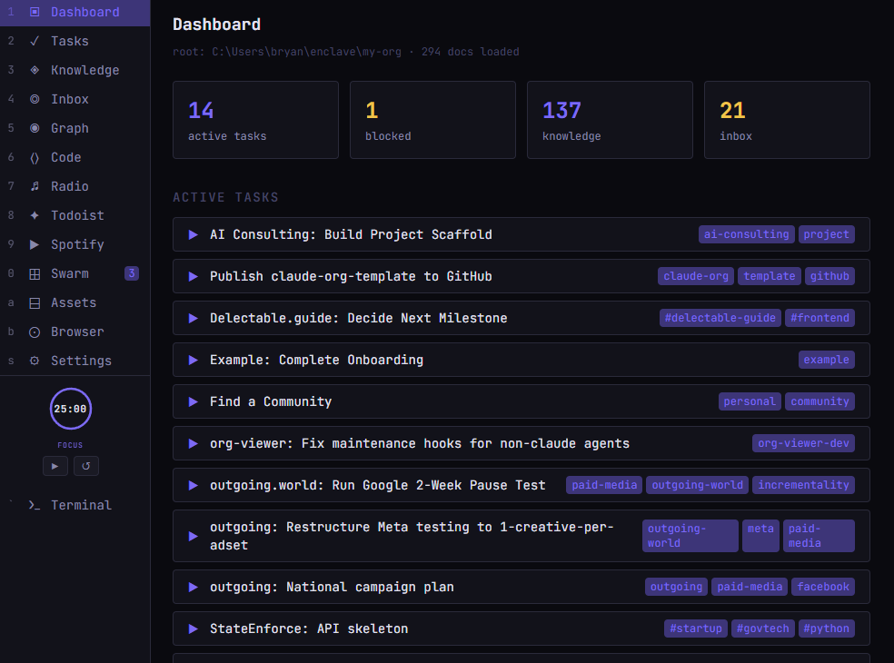
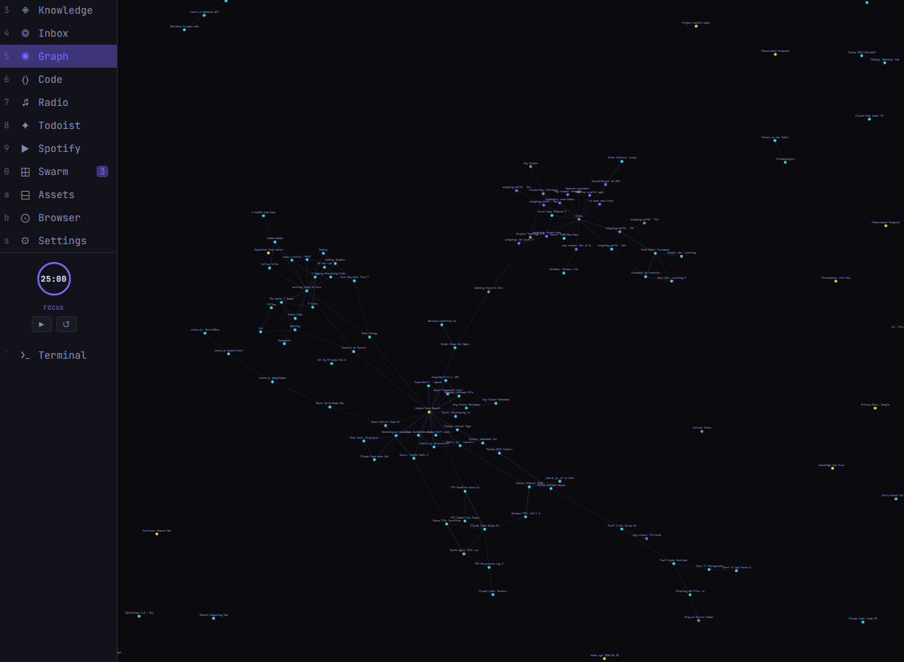
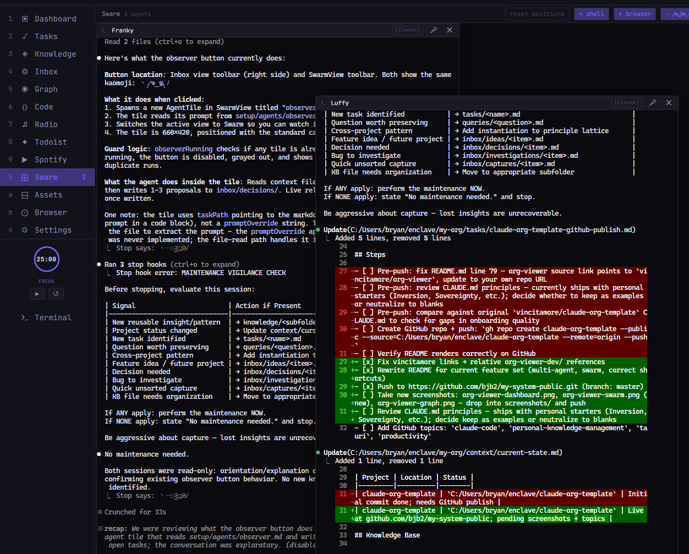

# My System

A personal organization system built around AI coding agents. Local-first markdown files, a stop hook that enforces session hygiene, and a bundled document viewer with a full workspace interface — no cloud dependency required.



---

## What It Is

A structured workspace that any AI coding agent can orient to quickly. You fill in your voice, projects, and working style once. After that, your agent always arrives knowing who you are, what you're working on, and how you like to collaborate.

Three things make it work:

1. **Architecture as memory** — continuity lives in flat files, not in the agent's context window. Any session picks up where the last one left off.
2. **Stop hook** — before every session ends, the agent evaluates what should be captured, updated, or created. Maintenance becomes automatic rather than disciplined.
3. **Org viewer** — a native workspace bundled in this repo. Run it and you get a full interface for browsing documents, running agents, and managing your work.

Works with Claude Code out of the box. Configurable for any agent via `org.config.json`.

---

## Prerequisites

- An AI coding agent (Claude Code, Cursor, Aider, or any CLI-based agent)
- Python 3.10+ — for the hooks
- Windows — the bundled binary is Windows-only. macOS/Linux users can build from source in `org-viewer-dev/`.

---

## Quick Start

```
1. Clone this repo
2. Run org-viewer.exe
3. Open the folder in your agent and paste the init prompt below
```

### The Init Prompt

Copy and paste this into your agent to begin setup:

```
Let's set up this organization system. Read through CLAUDE.md and the onboarding
playbook (ONBOARDING.md), then walk me through the full setup. Ask me questions,
help me fill in my voice and project docs, install the hooks, and clean up the
scaffolding when we're done.
```

That's it. The agent will guide you through the rest.

---

## What You Get

### Document Structure

```
├── context/        — voice, projects, current state (who you are + what matters)
├── tasks/          — active work with semantic status tracking
├── inbox/          — captures, decisions, ideas, investigations
├── knowledge/      — distilled insights, organized by domain
├── projects/       — larger efforts with their own structure
├── reminders/      — time-based reminders
└── setup/          — hooks, agents, and installation scripts
```

### Org Viewer

A native workspace bundled in this repo. No installation, no configuration — double-click and it runs.



**Views** (keyboard shortcuts `1`–`0`):

| Key | View | Description |
|-----|------|-------------|
| `1` | Dashboard | Doc counts, recent activity, top tags |
| `2` | Tasks | Active tasks filtered by status |
| `3` | Knowledge | Browse and search the knowledge base |
| `4` | Inbox | Triage captures, decisions, investigations |
| `5` | Graph | Document connections via wikilinks |
| `6` | Code | Code file browser |
| `7` | Radio | Internet radio streaming |
| `8` | Todoist | Task sync with Todoist notifications |
| `9` | Spotify | Spotify playback controls |
| `0` | Swarm | Multi-agent tiling workspace |

**Swarm view** runs multiple agent sessions side-by-side in resizable, draggable tiles. Each tile is an independent terminal running any configured agent. Useful for parallel work — one agent writing code while another reviews, or a dedicated distiller agent capturing knowledge as you work.



**Other features:**
- Full-text search across your entire org (`/` or `Ctrl+K`)
- Sidebar terminal panel for quick commands
- Edit documents directly in the viewer
- Theme cycling with `t`
- Remote access via Tailscale — browse your org from any device

[Full documentation](ORG-VIEWER.md) | [Source](org-viewer-dev/)

### Maintenance Hook

The stop hook is the immune system of the org. Before your agent ends any session, it evaluates:

- New reusable insights → `knowledge/`
- Project status changes → `context/current-state.md`
- New tasks to create → `tasks/`
- Friction or ADHD pain → `inbox/decisions/`

Without the hook, maintenance depends on remembering to do it. With it, maintenance happens automatically.

### Specialized Agents

Optional subagent configurations in `setup/agents/`:

| Agent | Purpose |
|-------|---------|
| `architect` | Design and architectural planning |
| `reviewer` | Code review + principle alignment |
| `distiller` | Extract knowledge worth capturing |
| `explorer` | Deep codebase/org understanding |
| `observer` | Weekly audit: gaps, orphans, improvement proposals |
| `qa-reviewer` | Verify acceptance criteria at runtime |

---

## Setup Details

### Hooks (Essential)

The stop hook enforces session hygiene automatically. Run the installer:

```bash
python setup/install.py
```

This copies hooks to `~/.claude/hooks/` and prints the `settings.json` configuration you need to add. See [setup/README.md](setup/README.md) for manual installation steps.

### Agent Configuration

The org viewer reads `org.config.json` in the repo root to determine which agent to launch in Swarm tiles. Claude Code is the default. To configure a different agent, edit the `agents` block:

```json
{
  "defaultAgent": "claude",
  "agents": {
    "claude": {
      "label": "Claude",
      "launchCmd": "claude",
      "printArgs": ["--print"],
      "promptQuote": "single"
    }
  }
}
```

### Agents (Optional)

Copy agent definitions to `~/.claude/agents/`. See [setup/README.md](setup/README.md) for the JSON wrapper format.

### Obsidian (Alternative Viewer)

If you prefer Obsidian over the bundled viewer, this workspace opens as an Obsidian vault. See [setup/obsidian/README.md](setup/obsidian/README.md).

---

## Remote Access

Install [Tailscale](https://tailscale.com/download) and run the org viewer — you can browse your org from a phone or any device on your Tailscale network.

---

## Customization

This system is scaffolding, not scripture. The only load-bearing constraint is frontmatter consistency — the YAML at the top of each file is what the viewer and hooks use to parse state. As long as files have valid frontmatter with `type`, `status`, `created`, and `tags`, everything works.

Everything else: folder names, principles, tag taxonomy, inbox categories, hook behavior — change it to fit how you actually think and work.

---

## Philosophy

The key insight: AI agents don't persist memory between sessions, but a well-structured workspace creates an *attractor basin* — terrain shaped by consistent thinking that any agent instance can orient to quickly. The more thoughtfully you shape your context files, the faster your agent finds its footing.

Full system documentation: [CLAUDE.md](CLAUDE.md)
